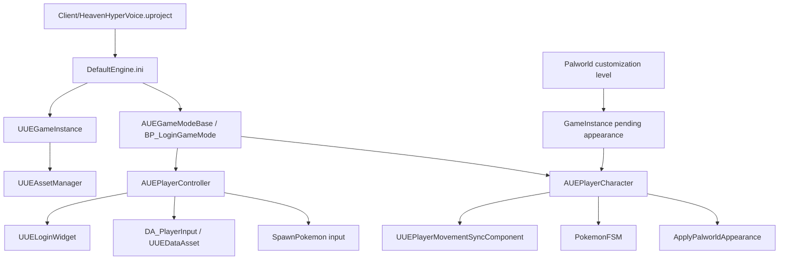
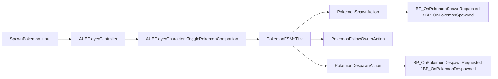
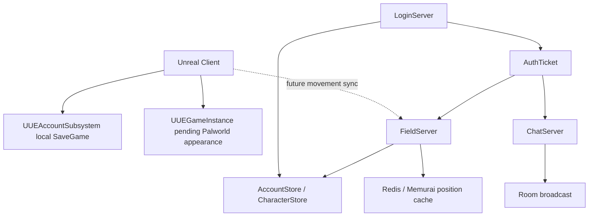

# HeavenHyperVoice 코드 구조 README

이 문서는 저장소 전체를 처음부터 다시 읽기 위한 지도다. 커마 한 부분만 보는 문서가 아니라, `Client`, `Server`, `Tools`, `UI`, `Docs`가 각각 어떤 역할을 하고 어디서 이어지는지 정리한다.

현재 기준:

- 클라이언트: Unreal Engine 5.8 프로젝트
- 서버: Windows 전용 C++20 / CMake / Ninja Multi-Config / vcpkg 프로젝트
- 핵심 기능: 로그인 UI, 로컬 계정 저장, 플레이어 입력/이동, 동행 포켓몬 프로토타입, Palworld 커스터마이징 레벨, 별도 Login/Field/Chat 서버

## 루트 구조

| 경로 | 역할 |
|---|---|
| `Client/` | Unreal 클라이언트 프로젝트. 실제 게임 코드, 블루프린트, 맵, 입력, 커마, 포켓몬 관련 에셋이 들어 있다. |
| `Server/` | 별도 C++ 서버 프로젝트. LoginServer, FieldServer, ChatServer, Launcher, 공용 Net/Protocol/Data 라이브러리로 나뉜다. |
| `Docs/` | 작업 문서와 세부 분석 문서. Palworld 커마 세부 구조 문서도 여기에 있다. |
| `Tools/VRoidPresetExporter/` | 이전 VRoid 프리셋 추출용 도구. 현재 Palworld 커마 구조와는 별도 흐름이다. |
| `UI/Images/` | UI 이미지 참고 자료 또는 생성 리소스 보관 영역이다. |
| `Intermediate/` | Unreal/C++ 빌드 중간 산출물. 소스 기준으로 읽을 파일은 아니다. |
| `OFIO/` | 현재 확인 기준으로 비어 있는 루트 폴더다. |

## 먼저 열 파일

| 목적 | 파일 |
|---|---|
| Unreal 프로젝트 열기 | `Client/HeavenHyperVoice.uproject` |
| 클라이언트 모듈 의존성 확인 | `Client/Source/HeavenHyperVoice/HeavenHyperVoice.Build.cs` |
| 기본 맵/게임모드/게임인스턴스 확인 | `Client/Config/DefaultEngine.ini` |
| 서버 빌드 설정 확인 | `Server/CMakeLists.txt`, `Server/CMakePresets.json`, `Server/vcpkg.json` |
| 서버 빌드 실행 | `Server/build.ps1` |
| Palworld 커마 상세 문서 | `Docs/PalworldCustomizationCodeStructure.md` |

## 전체 실행 흐름



기본 시작은 `DefaultEngine.ini`에서 잡힌다.

- `GameDefaultMap=/Engine/Maps/Templates/OpenWorld`
- `GlobalDefaultGameMode=/Game/Blueprints/Login/BP_LoginGameMode.BP_LoginGameMode_C`
- `GameInstanceClass=/Script/HeavenHyperVoice.UEGameInstance`

`UUEGameInstance::Init()`에서 `UUEAssetManager::Initialize()`를 부르고, 플레이어 컨트롤러는 시작 시 입력 매핑을 붙인 뒤 로그인 UI를 띄운다. Palworld 커마에서 넘어온 외형이 `GameInstance`에 남아 있으면 로그인 UI를 건너뛰고 플레이어 캐릭터에 외형을 바로 적용한다.

## Client 구조

### 모듈 설정

`Client/Source/HeavenHyperVoice/HeavenHyperVoice.Build.cs`가 클라이언트 C++ 모듈의 의존성을 잡는다.

주요 의존성:

- `Core`, `CoreUObject`, `Engine`, `InputCore`
- `EnhancedInput`
- `AssetRegistry`
- `GameplayTags`
- `UMG`
- `GameplayAbilities`, `GameplayTasks`
- 에디터 빌드일 때 `UnrealEd`

### AbilitySystem

경로: `Client/Source/HeavenHyperVoice/AbilitySystem/`

| 파일 | 역할 |
|---|---|
| `UEAbilitySystemComponent.*` | Gameplay Ability System용 커스텀 AbilitySystemComponent. 캐릭터 능력 부여와 태그 기반 능력 활성화 진입점이다. |
| `UEGameplayAbility.*` | 프로젝트 전용 GameplayAbility 기본 클래스다. |
| `AttributeSet/UEAttributeSet.*` | AttributeSet 자리다. 현재는 대부분의 속성이 비어 있거나 주석 처리된 초기 구조다. |

현재 상태는 “GAS를 붙이기 위한 뼈대”에 가깝다. 실제 체력, 스태미나, 데미지 계산 같은 게임플레이 속성은 아직 본격 구현된 상태로 보이지 않는다.

### AI

경로: `Client/Source/HeavenHyperVoice/AI/`

| 파일 | 역할 |
|---|---|
| `UEAIController.*` | 프로젝트 전용 AIController 기본 클래스다. 현재는 확장 지점 성격이 강하다. |

### Animation

경로: `Client/Source/HeavenHyperVoice/Animation/`

| 파일 | 역할 |
|---|---|
| `UEAnimInstance.*` | 플레이어 애니메이션 블루프린트가 읽을 이동 상태를 정리한다. |

`UUEAnimInstance`는 `OwnerCharacter`, `GroundSpeed`, `DirectionAngle`, `MovementInput`, `bIsMoving`, `bIsRunning`, `bIsRolling`, `bIsFalling` 같은 값을 매 프레임 갱신한다. 애니메이션 블루프린트는 이동 코드를 직접 파고들지 않고 이 값을 읽는 구조다.

### Character

경로: `Client/Source/HeavenHyperVoice/Character/`

| 파일 | 역할 |
|---|---|
| `UEPlayerCharacter.*` | 실제 플레이어 Pawn/Character. 카메라, 이동, Palworld 외형 적용, 동행 포켓몬 생성/해제, 서버 이동 보정의 중심이다. |

`AUEPlayerCharacter`가 들고 있는 주요 구성:

- `CameraBoom`, `FollowCamera`: 3인칭 카메라
- `MovementSyncComponent`: 서버 이동 보정/패킷 기록 컴포넌트
- `PalworldBodyEquipmentMesh`, `PalworldHeadMesh`, `PalworldHairMesh`: Palworld 외형용 추가 SkeletalMeshComponent
- `PalworldCustomizationCatalog`: 커마 선택지 DataAsset
- `PlayerAnimationData`: 몽타주/시퀀스 DataAsset
- `PokemonCompanionClass`, `SpawnedPokemon`: 동행 포켓몬 생성 흐름

중요 함수:

- `SetMovementInput()`: 컨트롤러가 계산한 이동 입력을 캐릭터에 전달한다.
- `ApplyLocalMovementInput()`: 입력을 실제 CharacterMovement 입력으로 바꾼다.
- `ApplyServerMovementCorrection()`: 서버 보정값을 캐릭터에 적용한다.
- `TogglePokemonCompanion()`: 동행 포켓몬 생성/해제 요청을 바꾼다.
- `ApplyPalworldAppearance()`: 커마 선택에 따라 몸, 머리, 헤어, 눈, 의상 메시와 머티리얼/색/스케일을 적용한다.
- `ApplyPendingPalworldAppearance()`: `GameInstance`에 저장된 커마 상태가 있으면 가져와 적용한다.

### CharacterCustomization / Palworld

경로: `Client/Source/HeavenHyperVoice/CharacterCustomization/Palworld/`

| 하위 경로 | 역할 |
|---|---|
| `Data/UEPalworldCustomizationTypes.*` | 커마 데이터 모델. 성별, 카테고리, 색 채널, 스케일 채널, 선택지, 최종 외형 상태를 정의한다. |
| `Preview/UEPalworldCustomizationPreviewActor.*` | 커마 레벨 중앙의 미리보기 캐릭터. 메시 교체, 머티리얼 적용, 색/스케일 적용, QA 스크린샷, 카메라 프레이밍을 담당한다. |
| `UI/UEPalworldCustomizationWidget.*` | 커마 UI 위젯. 카테고리/옵션/팔레트/스케일/스타트 버튼과 마우스 회전/이동/확대축소 입력을 처리한다. |
| `Framework/UEPalworldCustomizationPlayerController.*` | 커마 레벨 전용 컨트롤러. 기본 Pawn을 숨기고, PreviewActor를 뷰타겟으로 잡고, 커마 위젯을 viewport에 올린다. |

커마 데이터 핵심 타입:

- `EUEPalworldGender`: TypeA / TypeB
- `EUEPalworldCustomizationCategory`: Body, Head, Hair, Eyes, BodyEquipment
- `EUEPalworldColorChannel`: Skin, Hair, Eye
- `EUEPalworldScaleChannel`: TorsoSize, ArmSize, LegSize
- `FUEPalworldCustomizationOption`: 선택지 하나. 표시명, 카테고리, 남/여 메시, 아이콘, 머티리얼을 가진다.
- `FUEPalworldAppearance`: 현재 선택된 최종 커마 상태. 성별, 각 카테고리 인덱스, 피부/머리/눈 색, 팔/몸통/다리 볼륨을 가진다.
- `UUEPalworldCustomizationCatalog`: Body/Head/Hair/Eyes/BodyEquipment 옵션 배열과 색 팔레트를 가진 DataAsset이다.

커마에서 게임으로 넘어가는 흐름:

1. `UUEPalworldCustomizationWidget::StartWithCurrentAppearance()`가 현재 PreviewActor 상태를 읽는다.
2. `UUEGameInstance::SetPendingPalworldAppearance()`로 임시 외형을 저장한다.
3. `UGameplayStatics::OpenLevel()`로 `PlayerTestLevel`을 연다.
4. `AUEPlayerController::OnPossess()` 또는 `AUEPlayerCharacter::BeginPlay()` 흐름에서 `GetPendingPalworldAppearance()`를 읽는다.
5. `AUEPlayerCharacter::ApplyPalworldAppearance()`가 실제 플레이어 캐릭터에 외형을 적용한다.

Palworld 관련 에셋 위치:

- `Client/Content/CharacterCustomization/Palworld/Maps/L_PalworldCustomization.umap`
- `Client/Content/CharacterCustomization/Palworld/Materials/M_PalworldCharacterMaster.uasset`
- `Client/Content/CharacterCustomization/Palworld/AssetsFBX/Pal/...`
- `Client/Content/CharacterCustomization/Palworld/Generated/MorphSafeMaterials/...`

현재 커마 쪽은 작업 중인 영역이다. 머티리얼 슬롯, 원본 에셋 매칭, 의상별 적용 검증, 얼굴/눈 슬롯 충돌 같은 문제를 계속 확인해야 하는 상태다. 세부 내용은 `Docs/PalworldCustomizationCodeStructure.md`에 더 자세히 분리되어 있다.

### Component

경로: `Client/Source/HeavenHyperVoice/Component/`

| 파일 | 역할 |
|---|---|
| `UEPlayerMovementSyncComponent.*` | 클라이언트 이동 패킷 기록과 서버 보정 적용을 담당하는 컴포넌트다. |

`FUEPlayerMovementPacket`은 Sequence, DeltaSeconds, 입력값, 클라이언트 위치/속도/컨트롤 회전/액터 회전을 담는다.

중요한 점:

- `OnCharacterMovementUpdated`에서 이동 패킷을 만든다.
- `HandleServerMovementResult`에서 서버 위치와 클라이언트 위치 차이를 보고 보정한다.
- `SendMovementPacketToServer`는 현재 실제 네트워크 송신이 붙은 완성 구현이 아니라 TODO 성격의 자리다.

즉, 이 컴포넌트는 “서버 권위 이동으로 가기 위한 클라이언트 측 뼈대”다.

### Data

경로: `Client/Source/HeavenHyperVoice/Data/`

| 파일 | 역할 |
|---|---|
| `UEDataAsset.*` | 플레이어 입력 DataAsset. InputMappingContext와 Move/Look/Run/Roll/Jump/SpawnPokemon InputAction 슬롯을 가진다. |
| `UEPrimaryDataAsset.*` | 프로젝트 에셋 카탈로그. 에셋 이름/라벨을 경로와 매핑하고 `PreSave`에서 역색인을 만든다. |
| `UEPlayerAnimationDataAsset.*` | 플레이어 애니메이션 DataAsset. 기본 시퀀스와 몽타주, 태그 기반 추가 목록을 가진다. |

`UUEPlayerAnimationDataAsset` 구조:

- 기본 시퀀스: Idle, Walk, Run, Jump, Fall
- 기본 몽타주: Roll, Attack, Hit, Death
- 확장 목록: `MontageEntries`, `SequenceEntries`
- 검색 함수: `FindMontageByTag()`, `FindSequenceByTag()`

플레이어 몽타주나 애니메이션 시퀀스를 블루프린트나 C++에서 통일된 방식으로 찾기 위한 데이터 자산이다.

### GameMode

경로: `Client/Source/HeavenHyperVoice/GameMode/`

| 파일 | 역할 |
|---|---|
| `UEGameModeBase.*` | 기본 PlayerController와 DefaultPawnClass를 프로젝트 클래스에 연결한다. |

현재 기본값:

- `PlayerControllerClass = AUEPlayerController`
- `DefaultPawnClass = AUEPlayerCharacter`

### Map

경로: `Client/Source/HeavenHyperVoice/Map/`

| 파일 | 역할 |
|---|---|
| `HHVMapTypes.h` | 서버 런타임 맵에서 쓰는 벡터, AABB/OBB, 에이전트 설정 같은 기본 타입. |
| `HHVServerMapRuntime.*` | 서버용 맵 데이터를 런타임에서 읽고 쿼리하는 구조. |
| `HHVPathfinder.*` | 맵 런타임을 기반으로 경로 탐색을 수행하는 코드. |
| `UEServerMapFile.*` | Unreal 월드에서 서버용 맵 데이터를 내보내는 파일/Commandlet. |
| `UEServerHeightMapBuilder.*` | 높이맵 데이터를 만드는 빌더. |

이 영역은 클라이언트 렌더링용 맵과 별개로, 서버가 충돌/높이/이동 가능 영역을 이해하기 위한 데이터를 만드는 쪽이다.

### Player

경로: `Client/Source/HeavenHyperVoice/Player/`

| 파일 | 역할 |
|---|---|
| `UEPlayerController.*` | 로그인 UI, Enhanced Input, 플레이어 이동 입력, 동행 포켓몬 토글, 커마 외형 적용 흐름을 연결한다. |

입력 흐름:

1. `DA_PlayerInput`을 로드한다.
2. `EnhancedInputLocalPlayerSubsystem`에 MappingContext를 추가한다.
3. MoveForward/MoveBackward/MoveRight/MoveLeft가 `PendingMovementInput`을 갱신한다.
4. 매 입력 변경마다 `AUEPlayerCharacter::SetMovementInput()`으로 넘긴다.
5. LookYaw/LookPitch는 `AddYawInput`, `AddPitchInput`으로 처리한다.
6. SpawnPokemon 액션은 `AUEPlayerCharacter::TogglePokemonCompanion()`으로 이어진다.

현재 확인 기준으로 Run/Roll/Jump 태그와 DataAsset 슬롯은 있지만, PlayerController의 주요 바인딩 흐름은 이동/시점/포켓몬 토글 중심이다. 추가 액션을 실제로 쓰려면 바인딩과 캐릭터 구현을 같이 확인해야 한다.

### Pokemon

경로: `Client/Source/HeavenHyperVoice/Pokemon/`

| 파일 | 역할 |
|---|---|
| `PokemonAITypes.h` | 동행 포켓몬 FSM이 쓰는 상태, 요청, 명령, Context 타입을 정의한다. |
| `PokemonAIAction.h` | FSM 액션 인터페이스. `GetRequestType()`, `Tick()`을 제공한다. |
| `PokemonFSM.*` | Spawn/Despawn/FollowOwner 액션을 조합하는 동행 포켓몬 상태머신이다. |
| `PokemonSpawnAction.*` | 소환 요청을 처리하는 액션. |
| `PokemonDespawnAction.*` | 해제 요청을 처리하는 액션. |
| `PokemonFollowOwnerAction.*` | 비전투 상태에서 주인을 따라가게 하는 액션. |
| `UEPokemonCharacter.*` | 동행 포켓몬 캐릭터. 서버 이동 스냅샷/보정 관련 함수와 테스트 서버 컴포넌트를 가진다. |
| `UEPokemonTestServerComponent.*` | 포켓몬 테스트용 서버 움직임 시뮬레이션 컴포넌트다. |

흐름:



현재 클라이언트 포켓몬 동행은 로컬 프로토타입 성격이 강하다. 서버 `FieldServer`가 관리하는 필드 엔티티와 완전히 통합되어 있다고 보기는 어렵다.

### System

경로: `Client/Source/HeavenHyperVoice/System/`

| 파일 | 역할 |
|---|---|
| `UEAssetManager.*` | 프로젝트 에셋 로딩 관리자. 경로/이름/라벨 기준 동기/비동기 로딩과 해제를 제공한다. |
| `UEGameInstance.*` | 게임 인스턴스. AssetManager 초기화와 Palworld 커마 임시 외형 저장을 담당한다. |
| `UEAccountSubsystem.*` | 클라이언트 로컬 계정 등록/로그인/검증 서브시스템. |
| `UEAccountSaveGame.*` | 로컬 계정 저장용 SaveGame. |

`UUEAccountSubsystem`은 현재 클라이언트 로컬 로그인 프로토타입이다.

- 닉네임 길이 검증
- ID 길이와 문자 검증
- 비밀번호 최소 길이 검증
- 중복 ID 확인
- Salt + Blake3 기반 로컬 해시 저장
- `HV_LocalAccounts` SaveGame 슬롯 사용

이 구조는 개발용 로컬 로그인으로 봐야 한다. `Server/LoginServer`의 계정 서버 흐름과 완전히 연결된 온라인 인증 클라이언트는 아니다.

### UI / Login

경로: `Client/Source/HeavenHyperVoice/UI/Login/`

| 파일 | 역할 |
|---|---|
| `UELoginWidget.*` | C++로 구성된 로그인/회원가입 UI. 탭, 입력칸, 중복 검사, 상태 메시지, 로그인 성공 delegate를 관리한다. |

로그인 흐름:

1. `AUEPlayerController::BeginPlay()`가 로그인 화면 표시 여부를 결정한다.
2. `ShowLoginScreen()`이 `UUELoginWidget`을 viewport에 올린다.
3. 위젯은 `UUEAccountSubsystem`을 통해 로컬 등록/로그인을 처리한다.
4. 성공 시 `OnLoginSucceeded` delegate가 호출된다.
5. `AUEPlayerController::HandleLoginSucceeded()`가 UI를 닫고 게임 입력 모드로 바꾼다.

### GameplayTags

경로: `Client/Source/HeavenHyperVoice/UEGameplayTags.*`

입력과 캐릭터 상태 태그를 중앙에서 정의한다.

입력 태그:

- `Input.Action.MoveForward`
- `Input.Action.MoveBackward`
- `Input.Action.MoveRight`
- `Input.Action.MoveLeft`
- `Input.Action.LookYaw`
- `Input.Action.LookPitch`
- `Input.Action.Run`
- `Input.Action.Roll`
- `Input.Action.Jump`
- `Input.Action.SpawnPokemon`

상태 태그:

- `State.Character.Idle`
- `State.Character.Walk`
- `State.Character.Run`
- `State.Character.Roll`
- `State.Character.Jump`
- `State.Character.Fall`

## Client Content 구조

경로: `Client/Content/`

| 폴더 | 역할 |
|---|---|
| `Animation/` | 애니메이션 관련 에셋. |
| `Blueprints/` | 게임모드, 로그인 등 블루프린트. |
| `Character/` | 캐릭터 관련 메시/블루프린트/자료. |
| `CharacterCustomization/` | Palworld 커마용 맵, 원본 FBX 계열 에셋, 생성 머티리얼. |
| `Data/` | Input DataAsset 등 게임 데이터 에셋. |
| `Input/` | Enhanced Input 액션/매핑 에셋. |
| `Level/`, `Maps/` | 레벨/맵 에셋. |
| `Pokemon/` | 포켓몬 관련 블루프린트. 현재 `BP_Pokemon.uasset`가 확인된다. |
| `UI/` | Unreal UI 에셋. |

## Server 구조

서버는 `Server/` 아래 별도 C++20 프로젝트다. Unreal 내장 서버 코드가 아니라, 독립 실행 파일 여러 개로 나뉜 구조다.

빌드 관련:

- `Server/CMakeLists.txt`: Protocol, Net, Data, LoginServer, ChatServer, FieldServer, Launcher 하위 프로젝트를 추가한다.
- `Server/CMakePresets.json`: `windows-x64` preset. Ninja Multi-Config와 `x64-windows` vcpkg triplet 사용.
- `Server/vcpkg.json`: `openssl`, `flatbuffers`, `spdlog`, `argon2[hwopt]`, `hiredis` 의존성.
- `Server/build.ps1`: MSVC 환경과 vcpkg를 찾고 CMake configure/build를 실행한다.

서버 하위 구조:

| 경로 | 역할 |
|---|---|
| `Protocol/` | FlatBuffers 기반 프로토콜, 패킷 codec, 인증 ticket, 필드 지오메트리, 포켓몬 스탯 계산 자료. |
| `Net/` | IOCP/TLS 기반 서버 공통 코드. `TlsServer`, `TlsSession`, `FrameHandler`, `WorkQueue`, `RedisClient`, 인증서/자격증명 로딩. |
| `Data/` | 계정/캐릭터 저장소 인터페이스와 구현. `DevStore`, `OdbcStore`, `PasswordHash`. |
| `LoginServer/` | 로그인, 회원가입, 캐릭터 생성/삭제/선택, 서비스 ticket 발급. |
| `FieldServer/` | 필드 입장, 이동 처리, 월드 엔티티/시야 관리, Redis 위치 캐시 연동. |
| `ChatServer/` | 채팅방, Hello ticket 검증, 메시지 송수신. |
| `Launcher/` | 여러 서버 프로세스를 한 번에 띄우는 실행기. |
| `DataBase/` | DB 마이그레이션 SQL. |
| `tools/` | 개발 인증서, 인증 키, Memurai/Redis, 마이그레이션 보조 스크립트. |

### Protocol

경로: `Server/Protocol/`

| 파일 | 역할 |
|---|---|
| `Framing.h` | 프레임 바이트 처리 공통 타입. |
| `LoginCodec.h` | 로그인/캐릭터 선택/서비스 endpoint 응답 codec. |
| `FieldCodec.h` | 필드 입장, 이동, snapshot 등 필드 서버용 codec. |
| `ChatCodec.h` | 채팅 Hello/Say 관련 codec. |
| `AuthTicket.*` | Ed25519 계열 ticket 서명/검증 구조. |
| `PokemonSpecies.h` | 포켓몬 종족 기본값과 스탯 계산 자료. |
| `FieldGeometry.h` | 필드 좌표/섹터/지오메트리 관련 자료. |

서버 인증은 LoginServer가 ticket을 발급하고, Field/Chat 서버가 해당 ticket을 검증하는 흐름이다. audience가 `field`, `chat`처럼 분리되어 있어 서로 다른 서비스 ticket을 구분하는 구조다.

### Net

경로: `Server/Net/`

| 파일 | 역할 |
|---|---|
| `TlsServer.*` | Windows IOCP 기반 TLS 서버 본체. |
| `TlsSession.*` | 클라이언트 연결 하나의 TLS 세션과 프레임 송수신. |
| `Tls.*` | TLS context/channel 공통 처리. |
| `FrameHandler.h` | 서버별 패킷 처리기가 구현하는 공통 인터페이스. |
| `WorkQueue.*` | DB/인증 같은 작업을 분리하기 위한 큐. |
| `RedisClient.*` | Redis/Memurai 위치 캐시 접근. |
| `Credentials.*` | 인증서, 비밀번호, 키 같은 자격증명 로딩. |
| `ServerMain.h` | 서버 main에서 공통으로 쓰는 실행 보조 구조. |

### Data

경로: `Server/Data/`

| 파일 | 역할 |
|---|---|
| `AccountStore.h` | 계정 저장소 인터페이스와 결과 타입. |
| `CharacterStore.h` | 캐릭터/파트너/위치 저장소 인터페이스와 결과 타입. |
| `DevStore.*` | 메모리 기반 개발용 저장소. |
| `OdbcStore.*` | ODBC 기반 실제 DB 저장소. |
| `PasswordHash.*` | 비밀번호 해싱. |

계정과 캐릭터 저장소는 인터페이스로 분리되어 있어, 서버 main에서 개발용 저장소나 ODBC 저장소를 선택할 수 있는 구조다.

### LoginServer

경로: `Server/LoginServer/`

`LoginHandler`가 세션 하나의 로그인 상태를 가진다.

주요 단계:

- `AwaitingLogin`: LoginRequest 또는 RegisterRequest 대기
- `Busy`: 인증/DB 작업 중
- `AwaitingSelection`: 로그인 성공 후 캐릭터 생성/삭제/선택 대기
- `Done`: 응답 후 연결 종료 단계

처리 함수:

- `handleLogin()`
- `handleRegister()`
- `handleCreateCharacter()`
- `handleSelectCharacter()`
- `handleDeleteCharacter()`
- `handleReleasePartner()`

캐릭터를 선택하면 Field/Chat 등 서비스 endpoint와 ticket을 발급하는 흐름이다.

### FieldServer

경로: `Server/FieldServer/`

`FieldHandler`는 세션 하나의 필드 입장/이동 상태를 관리한다.

주요 단계:

- `AwaitingEnter`: ticket을 포함한 Enter 요청 대기
- `Entering`: DB/캐시에서 캐릭터 위치를 읽는 중
- `InField`: 필드 입장 후 Move 처리
- `Done`: 세션 종료

`World`는 필드 서버의 런타임 엔티티 컨테이너다.

주요 역할:

- 캐릭터 입장/퇴장
- 위치 이동 처리
- 20Hz tick
- 섹터 기반 visible 집합 관리
- 엔티티 snapshot 전송
- 마지막 위치 저장용 positions 수집

Redis/Memurai는 `pos:{character_id}` 형태의 위치 캐시를 위해 붙는다. Redis가 없어도 DB만으로 움직일 수 있게 설계되어 있지만, 캐시를 붙이면 마지막 위치 보존과 복구가 빨라지는 구조다.

### ChatServer

경로: `Server/ChatServer/`

| 파일 | 역할 |
|---|---|
| `ChatHandler.*` | ticket 검증, 채팅방 입장, Say 요청 처리. |
| `Room.*` | 연결된 세션 목록과 방 브로드캐스트 관리. |
| `main.cpp` | ChatServer 실행 진입점. |

`ChatHandler`는 Hello로 ticket을 검증한 뒤, 들어온 Say 메시지를 Room에 넘겨 브로드캐스트한다.

### Launcher

경로: `Server/Launcher/`

여러 서버 실행 파일을 순서대로 띄우기 위한 프로세스 실행기다. 로컬 개발에서 Login/Field/Chat을 한 번에 띄우는 용도로 보면 된다.

## 주요 데이터/네트워크 관계



중요한 구분:

- 클라이언트의 `UUEAccountSubsystem`은 로컬 SaveGame 기반 로그인이다.
- 서버의 `LoginServer`는 별도 온라인 로그인/캐릭터 선택 서버다.
- 현재 코드만 보면 둘은 같은 계정 체계로 완전히 연결되어 있지 않다.
- `UUEPlayerMovementSyncComponent`도 서버 이동 보정 구조는 있지만 실제 네트워크 송신은 아직 완성된 상태로 보이지 않는다.

## 빌드와 실행

### Unreal 클라이언트

1. `Client/HeavenHyperVoice.uproject`를 Unreal Engine 5.8로 연다.
2. 기본 설정은 `Client/Config/DefaultEngine.ini`에서 확인한다.
3. 입력 DataAsset은 `Client/Content/Data/Input/DA_PlayerInput` 쪽을 확인한다.
4. Palworld 커마 레벨은 `Client/Content/CharacterCustomization/Palworld/Maps/L_PalworldCustomization.umap`이다.

### 서버

PowerShell에서:

```powershell
cd C:\git\HeavenHyperVoice\Server
.\build.ps1 -Config Debug
```

빌드 결과는 기본적으로:

```text
Server\build\windows-x64\bin\Debug\
```

서버 빌드에 필요한 것:

- Visual Studio C++ x64 toolset
- Ninja
- vcpkg
- Windows 환경

## 현재 구현 상태와 주의점

이 항목은 “이미 완성됐다”가 아니라, 현재 코드를 읽었을 때의 실제 상태를 구분하기 위한 것이다.

| 영역 | 현재 상태 |
|---|---|
| Unreal 엔진 | `HeavenHyperVoice.uproject` 기준 `EngineAssociation`은 `5.8`이다. |
| 로그인 UI | C++ 위젯 기반 로컬 로그인/회원가입은 구현되어 있다. |
| 온라인 로그인 | 서버 쪽 LoginServer는 있지만 클라이언트 로컬 로그인과 완전 연동된 상태로 보이지 않는다. |
| 입력 이동 | WASD/Look/SpawnPokemon 중심으로 Enhanced Input이 연결되어 있다. |
| Run/Roll/Jump | 태그와 DataAsset 슬롯은 있으나, 실제 바인딩/동작은 추가 확인이 필요하다. |
| 이동 동기화 | 패킷 기록과 보정 함수는 있으나 실제 송신 함수는 TODO 성격이다. |
| 포켓몬 동행 | 로컬 FSM/스폰/추적 프로토타입은 있다. 서버 Field 엔티티와 완전 통합된 구조는 아니다. |
| AbilitySystem | 프로젝트용 뼈대는 있으나 실제 속성/능력 구현은 초기 단계다. |
| Palworld 커마 | 커마 UI/Preview/외형 적용 흐름은 있다. 다만 원본 머티리얼/슬롯/의상 검증은 계속 손봐야 하는 작업 영역이다. |
| 서버 | Login/Field/Chat/Launcher가 분리된 독립 서버 구조다. Windows IOCP/TLS/vcpkg 기반이다. |

## 수정할 때 기준

새 기능을 넣을 때는 아래 기준으로 위치를 잡으면 된다.

| 하고 싶은 일 | 먼저 볼 곳 |
|---|---|
| 새 입력 추가 | `UEGameplayTags.*`, `UEDataAsset.*`, `UEPlayerController.*`, `Client/Content/Input` |
| 플레이어 이동 수정 | `UEPlayerController.*`, `UEPlayerCharacter.*`, `UEPlayerMovementSyncComponent.*` |
| 플레이어 애니메이션 추가 | `UEPlayerAnimationDataAsset.*`, `UEAnimInstance.*`, 애님 블루프린트 |
| 동행 포켓몬 행동 추가 | `PokemonAITypes.h`, `PokemonAIAction.h`, `PokemonFSM.*`, 각 Action 클래스 |
| Palworld 커마 옵션 추가 | `UEPalworldCustomizationTypes.*`, Catalog DataAsset, PreviewActor, Widget |
| Palworld 외형 게임 반영 수정 | `UUEGameInstance`, `UEPalworldCustomizationWidget`, `AUEPlayerCharacter::ApplyPalworldAppearance()` |
| 로컬 로그인 수정 | `UELoginWidget.*`, `UEAccountSubsystem.*`, `UEAccountSaveGame.*` |
| 온라인 로그인 서버 수정 | `Server/LoginServer`, `Server/Data`, `Server/Protocol/LoginCodec.h` |
| 필드 이동 서버 수정 | `Server/FieldServer`, `Server/Protocol/FieldCodec.h`, `Server/Net` |
| 채팅 서버 수정 | `Server/ChatServer`, `Server/Protocol/ChatCodec.h` |
| 서버 DB 수정 | `Server/DataBase`, `Server/Data/OdbcStore.*`, `Server/Data/*Store.h` |

## 문서 현황

- `README.md`: 지금 보고 있는 전체 구조 문서.
- `Docs/PalworldCustomizationCodeStructure.md`: Palworld 커마 코드 구조와 세부 작업 문서.
- `Client/Source/HeavenHyperVoice/CharacterCustomization/Palworld/README.md`: 커마 폴더 안의 세부 메모. 일부 기존 문서는 콘솔에서 인코딩이 깨져 보일 수 있다.
- `Server/README.md`: 서버용 기존 문서. 현재 PowerShell 출력에서 일부 한글이 깨져 보이므로, 정확한 구조는 이 README와 실제 헤더/CMake를 함께 보는 편이 안전하다.

## 짧은 결론

이 저장소는 Unreal 클라이언트와 독립 C++ 서버가 같이 있는 구조다. 클라이언트 안에는 로컬 로그인, 플레이어 입력/이동, 포켓몬 동행, Palworld 커마가 들어 있고, 서버는 Login/Field/Chat으로 분리되어 있다.

현재 가장 조심해서 봐야 할 곳은 Palworld 커마의 머티리얼/슬롯/의상 검증, 클라이언트 로컬 로그인과 서버 로그인의 분리, 그리고 이동 동기화의 실제 송신 미완성 부분이다.
